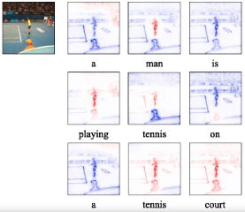
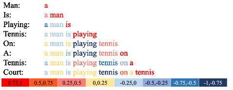

# LRP ImageCaptioning 
This is an implementation of [Understanding Image Captioning Model beyond Visualizing Attention](https://arxiv.org/abs/2001.01037)

With this repo, we can
1. Train two kinds of image captioning attention models.
2. Explain image captioning models with LRP, GradCAM, and Guided-GradCAM.
3. Finetune pre-trained image captioning models with LRP inference to reduce object hallucination. 

### Requirements
python3.5 
keras>=2.2.4

### Dataset Preparation
We use two dataset: the [Flickr30K](http://shannon.cs.illinois.edu/DenotationGraph/) and the [MSCOCO2017](https://cocodataset.org/#download).
##### Flickr30K
We prepare the Flick30K as the Karpathy split. The captions and train/val/test splits are indluced in [./dataset](./dataset/Flickr30k_text).
The vocabulary is build on the training set. We discard the words that appear less than 3 times.
##### MSCOCO2017
We select 110000 images from the training set for training and 5000 images from the training set for validation. The original validation set is used for testing.
The vocabulary is build on the training set. We discard the words that appear less than 5 times.
### To Train Models From Scratch
We experiment with two kinds of image captioning models, 
adaptive attention model and the grid-TD model based on two papers
 [Knowing When to Look: Adaptive Attention via A Visual Sentinel for Image Captioning](https://arxiv.org/abs/1612.01887) and 
 [Bottom-Up and Top-Down Attention for Image Captioning and Visual Question Answering](https://arxiv.org/abs/1707.07998).
 
1. Prepare the dataset and specify the dataset path in [config.py](config.py)
2. Load the dataset and specify the model_type and saving path and call the `main_attention()` function in [train.py](train.py).
 An example code is shown in [train.py](train.py) 

### Pretrained Models
Our pre-trained models are [here](https://drive.google.com/drive/folders/1_wXf6U-PlGcCGfVj9auZC0En8DfwNvFK?usp=sharing)
 
  
### To Evaluate the Image Captioning Model
We evaluate the image captioning models using BLEU, SPICE, ROUGE, METEOR, and CIDER metrics. We also use [BERT score](https://pypi.org/project/bert-score/). To generate these evaluations,
we first need to download the [pycocoevalcap](https://github.com/salaniz/pycocoevalcap.git) tools and copy the folders of different metrics under [./pycocoevalcap](pycocoevalcap). 
We already provide the `bert` folder. Then run the [inference.py](inference.py) after specifying the model path and the test dataset.

 

### To Explain Image Captioning Models
We provide LRP, GradCAM, Guided-GradCAM, and Gradient*Input to explain the image captioning models. These explanation methods are defined in [explainers.py](./models/explainers.py).

There are two stages for explanation. We first explain the decoder to get the explanation of each proceeding word and the CNN encoded image features.
We then refer to the repo [iNNvestigate](https://github.com/albermax/innvestigate.git) to explain the CNN image encoder.

To predict a caption of a test image and explain the captions, please refer the example code in [explain_image.py](explain_image.py).
An example of the LRP explanation result is shown as follow.

 

### To Fine-tune the Model with LRP Inference
The LRP-inference model is defined in [./models/model.py](./models/model.py). 

### To Evaluate the Explanations
##### Evaluating the correlation of the explanation scores and the location of object words
Please refer the examples in [evaluate_bbox.py](evaluate_bbox.py). This will generate the *correctness* score of different explanation scores.
To run the code, we need to download the [COCOvalEntities.json](https://drive.google.com/file/d/1ygSGtJ79FyocW-QshgeuIEQlu24QgF0x/view?usp=sharing) file
 and specify the path in the code.
##### Evaluating the mPA of frequent predicted object words.
Please refer the examples in [exaimin_word.py](exaimin_word.py) which calculate the mean average precision of the frequent predicted object words.
This file also contains functions that calculate the ROC curves and AUC scores for the frequent pedicted words. 

Acknowledgement
---------------
Many thanks to the works:

[keras image captioning](https://github.com/danieljl/keras-image-captioning.git)

[iNNvestigate](https://github.com/albermax/innvestigate.git)

[pycocoevalcap](https://github.com/salaniz/pycocoevalcap.git)

